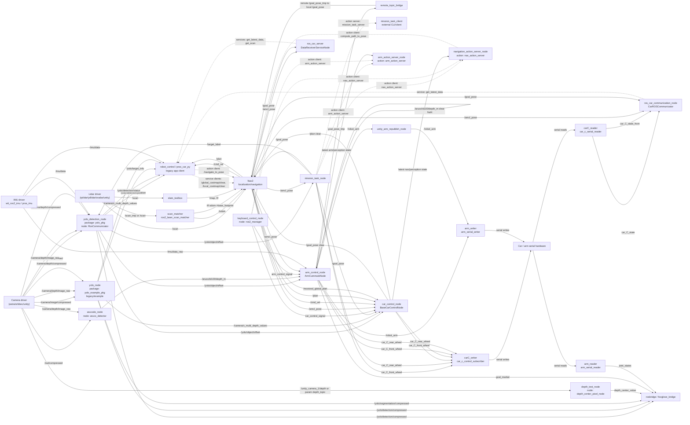

# ROS Node and Topic Relation Diagram

This diagram is based on static inspection of this repo's ROS 2 launch files,
entry points, publishers, subscribers, action clients/servers, service
clients/servers, and Docker compose commands. External stacks are included only
where this repo connects to their topics, actions, or services.

## Main Mission / Perception / Control Graph

## Compact Topic/Action Inventory

| Relation | Producers | Consumers |
| --- | --- | --- |
| `/camera/image/compressed` | camera driver / image transport | `yolo_detection_node`, `yolo_node`, `robot_control` legacy app |
| `/camera/color/image_raw` | camera driver / image transport | image transport republishers |
| `/out/compressed` | camera/image pipeline | `arucode_node` |
| `/camera/depth/image_raw` | camera driver | `yolo_detection_node`, `yolo_node`, `arucode_node` |
| `/camera/depth/compressed` | camera driver / image transport | `yolo_detection_node`, `yolo_node` |
| `/target_label` | `mission_task_node`, `robot_control` legacy app | `yolo_detection_node` |
| `/yolo/detection/compressed` | `yolo_detection_node`, `yolo_node` | visualization/bridge clients |
| `/yolo/object/offset` | `yolo_detection_node` | `car_control_node`, `arm_control_node`, `mission_task_node` |
| `/yolo/detection/position` | `yolo_detection_node` | `robot_control` legacy app |
| `/yolo/detection/status` | `yolo_detection_node` | `robot_control` legacy app |
| `/yolo/target_info` | `yolo_node` legacy/example | `robot_control` legacy app |
| `/camera/x_multi_depth_values` | `yolo_node` legacy/example | `car_control_node`, `robot_control` legacy app |
| `/aruco/id100/depth_m` | `arucode_node`, `arm_control_node` clear signal | `arm_control_node` |
| `/scan` | lidar/filter/unity driver | SLAM Toolbox, Nav2 costmaps, `car_control_node`, data service nodes, legacy app |
| `/scan_tmp` | rplidar/oradar raw driver | angle filter / scan matcher |
| `/odom` and `/tf` | scan matcher, robot state publisher, SLAM/Nav2 | Nav2, visualization clients |
| `/map` | SLAM Toolbox or map server | Nav2 |
| `/amcl_pose` | Nav2 localization | `car_control_node`, `arm_control_node`, `mission_task_node`, data service nodes, legacy app |
| `/goal_pose` | `mission_task_node`, `car_control_node`, remote bridge, legacy app | Nav2, `car_control_node`, data service nodes |
| `/move_base_simple/goal` | RViz/user tools | `car_control_node` |
| `/cmd_vel` | Nav2 controller | `car_control_node`, legacy app |
| `/plan` | Nav2 planner, `car_control_node` clear, legacy app | `car_control_node`, legacy app, visualization |
| `/received_global_plan` | legacy app | `car_control_node`, legacy app |
| `car_control_signal` | `keyboard_control_node` | `car_control_node` |
| `arm_control_signal` | `keyboard_control_node` | `arm_control_node` manual control |
| `car_C_front_wheel` | `mission_task_node`, `car_control_node`, `arm_control_node`, legacy app | `carC_writer` |
| `car_C_rear_wheel` | `mission_task_node`, `car_control_node`, `arm_control_node`, legacy app | `carC_writer` |
| `car_C_state`, `car_C_state_front` | `carC_reader` | downstream/debug consumers |
| `/robot_arm` | `arm_control_node`, `unity_arm_republish_node`, legacy app | `arm_writer`, Unity bridge |
| `joint_states` | `arm_reader` | robot state publisher / visualization |
| `goal_pose_tmp` | `arm_control_node` | `remote_topic_bridge` to local `/goal_pose` |
| `goal_marker` | `arm_control_node` | visualization clients |
| `nav_action_server` | server: `navigation_action_server_node` | clients: `keyboard_control_node`, `mission_task_node` |
| `arm_action_server` | server: `arm_action_server_node` | clients: `keyboard_control_node`, `mission_task_node` |
| `mission_task_server` | server: `mission_task_node` | mission task clients / keyboard or external caller |
| `compute_path_to_pose` | server: Nav2 planner | client: `navigation_action_server_node` |
| `/navigate_to_pose` | server: Nav2 behavior tree navigator | client: legacy `robot_control` app |
| `get_latest_data` | `ros_car_communication_node` or `ros_car_server` | service clients |
| `get_scan` | `ros_car_server` | service clients |
| `/global_costmap/clear`, `/local_costmap/clear` | Nav2 services | legacy `robot_control` app |

## Launch Entry Points Covered

- `workspace/pros/pros_car/src/mission_task_pkg/launch/task_bringup.launch.py`
  launches `car_control_node`, `arm_control_node`, `unity_arm_republish_node`, and
  `mission_task_node` for the mission stack.
- `workspace/pros/ros2_yolo_integration/src/yolo_pkg/launch/yolo_and_arucode.launch.py`
  launches `yolo_detection_node` and optionally `arucode_node`.
- `workspace/pros/pros_car/src/arm_control_pkg/launch/arm.launch.py` launches
  `arm_writer`, `arm_control_node`, and `unity_arm_republish_node`.
- `workspace/pros/pros_app/docker/compose/demo/*.xml` and `*.launch.py` wire
  external camera, lidar, SLAM, Nav2, rosbridge, and scan matcher components.

## Static Inspection Notes

- `car_control_pkg`, `arm_control_pkg`, and `mission_task_pkg` publish
  `std_msgs/Float32MultiArray` on `car_C_front_wheel` and `car_C_rear_wheel`.
  The legacy `pros_car_py.carC_serial_writer` subscribes as `std_msgs/String` and
  expects JSON. If that writer is used with the newer control packages, the topic
  names match but the message types do not.
- `arucode_node` subscribes to `/out/compressed`, while the camera compose files
  mostly republish camera streams under `/camera/...`. A remap or republisher is
  needed for ArUco in that setup.
