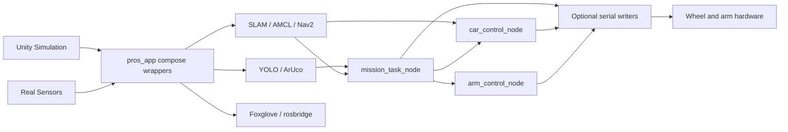
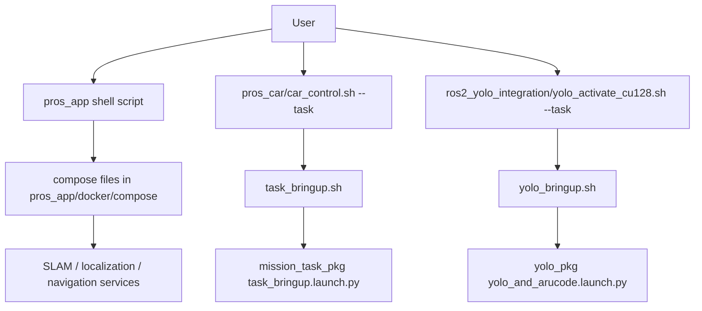
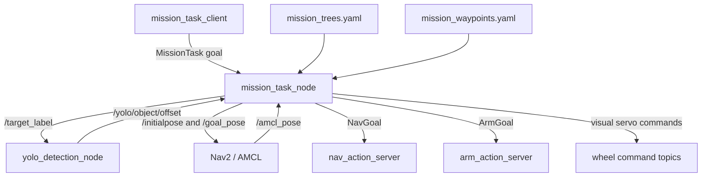

# Project Architecture

This document describes the current architecture of the repository after static
inspection of the launch files, wrapper scripts, ROS package entry points, and
mission configuration.

## Repository Structure

| Path | Role |
| --- | --- |
| `workspace/pros/pros_app` | Docker Compose launch layer for real and Unity sensors, SLAM, localization, Nav2, rosbridge/Foxglove, GPS, IMU, topic bridges, and map storage. |
| `workspace/pros/pros_car` | ROS 2 workspace for car control, arm control, mission orchestration, custom actions, robot description, and serial hardware adapters. |
| `workspace/pros/ros2_yolo_integration` | ROS 2 workspace for YOLO detection, bridge segmentation, object depth offsets, camera geometry, and ArUco depth detection. |
| `workspace/yolo_training` | Separate YOLO training container; not part of runtime car bringup. |
| `docs` | Workflow, architecture, real-vs-Unity split, node/topic graph, and migration notes. |

## High-Level Runtime

The default demo path is Unity-oriented: `task_bringup.launch.py` enables the
Unity arm republisher and disables the real wheel serial writer. The physical
robot path enables `enable_car_c_writer:=true` and disables the Unity arm bridge.

## Current Launch Flow

`task_bringup.sh` and `yolo_bringup.sh` both build their mounted workspaces
inside the running container before launching ROS nodes. That is convenient for
development, but slower than a prebuilt runtime image.

## Main Runtime Nodes

| Node or executable | Package | Started by | Purpose |
| --- | --- | --- | --- |
| `car_control_node` | `car_control_pkg` | `task_bringup.launch.py` | Car navigation/manual control logic and wheel command publisher. |
| `arm_control_node` | `arm_control_pkg` | `task_bringup.launch.py` | Arm control and arm action server behavior. |
| `unity_arm_republish_node` | `arm_control_pkg` | Optional in `task_bringup.launch.py` | Unity arm topic adaptation. |
| `carC_writer` | `pros_car_py` | Optional in `task_bringup.launch.py` | Real wheel serial writer. |
| `mission_task_node` | `mission_task_pkg` | `task_bringup.launch.py` | Mission action server and YAML-driven task executor. |
| `mission_task_client` | `mission_task_pkg` | Manual CLI | Sends task IDs to `mission_task_server`. |
| `yolo_detection_node` | `yolo_pkg` | `yolo_and_arucode.launch.py` | YOLO detection, object offsets, optional bridge segmentation output. |
| `arucode_node` | `arucode_pkg` | Optional in `yolo_and_arucode.launch.py` | ArUco marker depth detection. |

External nodes from `pros_app` compose files provide camera drivers, lidar
drivers, image transport, SLAM Toolbox, AMCL, Nav2, scan matching, rosbridge,
Foxglove bridge, and Unity adapters.

## Mission Architecture

`mission_task_node` is a ROS action server named `mission_task_server`. It
validates the requested `task_id` against
`mission_task_pkg/config/mission_trees.yaml` and executes a tree of reusable
primitives.

Current mission tasks:

| Task | Sequence |
| --- | --- |
| `task1_bear` | Prepare start pose, retry dynamic bear approach and visual servo, run `pickup_bear`, return to `start`, run `place_bear`. |
| `task2_bridge` | Prepare start pose, detect bridge, pre-align, conditionally yaw-turn, align bridge, align bear, climb, pick up bear, descend, navigate through `bridge_return_midpoint`, return, place. |
| `task3_knob` | Prepare start pose, navigate through three knob waypoints, target `knob`, visual-servo to `0.35 m`, run `grasp_knob`, timed-drive through the door. |

## Main Topics And Actions

| Interface | Type | Producer | Consumer | Purpose |
| --- | --- | --- | --- | --- |
| `mission_task_server` | `MissionTask` action | `mission_task_node` | `mission_task_client` | Starts selectable missions. |
| `nav_action_server` | `NavGoal` action | car navigation action server | `mission_task_node`, keyboard clients | Runs custom navigation modes. |
| `arm_action_server` | `ArmGoal` action | arm action server | `mission_task_node`, keyboard clients | Runs arm automation modes. |
| `/target_label` | `String` | `mission_task_node` | `yolo_detection_node` | Selects the object label YOLO should prioritize. |
| `/yolo/object/offset` | JSON in `String` | `yolo_detection_node` | mission, car, arm | Object offsets used for approach and servo. |
| `/yolo/detection/compressed` | compressed image | `yolo_detection_node` | visualization clients | Detection overlay stream. |
| `/amcl_pose` | `PoseWithCovarianceStamped` | localization | mission, car, arm | Current localized pose. |
| `/initialpose` | `PoseWithCovarianceStamped` | mission or user | AMCL | Initial localization pose. |
| `/goal_pose` | `PoseStamped` | mission or user tools | Nav2, car control | Navigation goal. |
| `/cmd_vel` | `Twist` | Nav2 | `car_control_node` | Optional wheel-control input when enabled. |
| `car_C_front_wheel` | wheel command | car, mission, arm | serial writer / Unity | Front wheel command topic. |
| `car_C_rear_wheel` | wheel command | car, mission, arm | serial writer / Unity | Rear wheel command topic. |
| `/robot_arm` | arm command | arm control / Unity republisher | arm writer / Unity | Arm command topic. |
| `/aruco/id100/depth_m` | `Float32` | ArUco node | arm control | Marker depth for arm behavior. |

For a more exhaustive graph, see `docs/node_topic_relation_diagram.md`.

## Compose And Network Model

The active compose files use an external Docker network named
`compose_my_bridge_network`. The shell wrappers use either `docker-compose` or
`docker compose`, depending on what is installed.

Current `pros_app` wrappers:

| Workflow | Scripts |
| --- | --- |
| Unity | `slam_unity.sh`, `localization_unity.sh`, `camera_calibration_unity.sh` |
| RPLidar | `slam.sh`, `localization.sh` |
| YDLidar | `slam_ydlidar.sh`, `localization_ydlidar.sh` |
| ORadar | `slam_oradarlidar.sh`, `localization_oradarlidar.sh` |
| Cameras | `camera_astra.sh`, `camera_dabai.sh`, `camera_gemini.sh`, `camera_calibration.sh` |
| Support | `gps.sh`, `imu.sh`, `rosbridge_server.sh`, `ros_topic_bridge.sh`, `store_map.sh` |

`control.sh` is a convenience menu but does not expose every script in the
folder. Direct script execution is the clearest workflow for demos.

## Current Technical Risks

- Multiple nodes can publish to `car_C_front_wheel` and `car_C_rear_wheel`.
  Mission visual servo, car control, and arm behavior can compete unless only
  the intended controller is active.
- `enable_cmd_vel_wheel_control` is disabled by default. Enabling it while a
  mission is publishing direct visual-servo wheel commands can cause command
  contention.
- `/yolo/object/offset` is JSON inside `std_msgs/String`. This is flexible but
  weakly typed; schema mistakes are caught only at runtime.
- The car writer path and newer wheel command publishers should be checked
  together before real hardware demos, because older code paths may expect a
  different message representation.
- `task_bringup.sh` and `yolo_bringup.sh` rebuild workspaces on startup. This is
  useful during development but can slow demos and hide dependency drift.
- The compose layer is flexible but fragmented across many small files. A
  single profile-based compose project would be easier to start, stop, and
  document.

## Recommended Next Refactors

1. Add a wheel command arbiter so navigation, mission servo, manual control, and
   arm behavior publish intent rather than directly competing on hardware
   topics.
2. Replace YOLO JSON strings with a typed custom message, or centralize and test
   the JSON schema.
3. Split development and demo startup: keep bind-mount rebuilds for development,
   and provide prebuilt runtime images for demos.
4. Consolidate `pros_app` compose files with shared anchors or profiles for
   common image, network, environment, and volume settings.
5. Add scenario-level launch commands for `unity_mission`, `real_mission`, and
   `perception`.
6. Add startup checks for required topics such as `/amcl_pose`, `/goal_pose`,
   camera streams, `/yolo/object/offset`, and wheel command topics.
