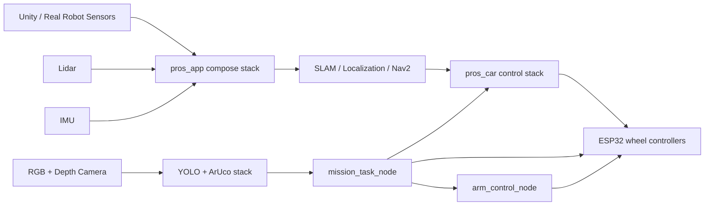
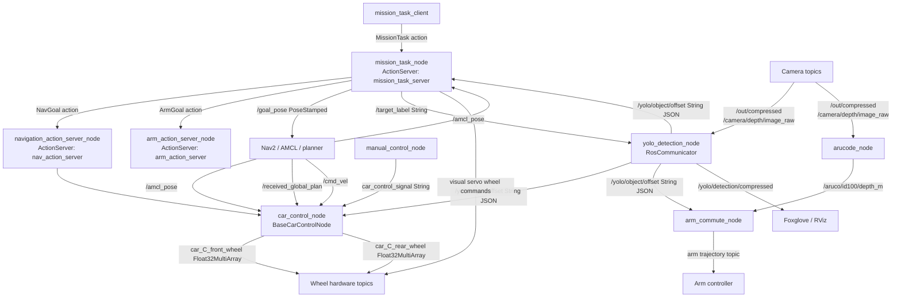
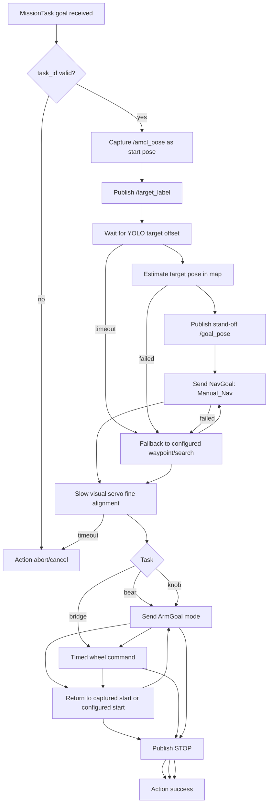
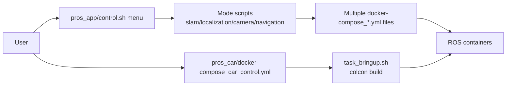

# Project Architecture Review

## Scope

This review covers the current ROS 2 project structure, node communication, mission task orchestration, and Docker/container workflow.

## Repository Structure

- `workspace/pros/pros_app`: Docker Compose launch layer for SLAM, localization, navigation, cameras, lidar, rosbridge, Foxglove, Unity support, and topic bridging.
- `workspace/pros/pros_car`: ROS 2 workspace for car control, arm control, mission orchestration, custom actions, and robot description.
- `workspace/pros/ros2_yolo_integration`: ROS 2 workspace for YOLO object detection, depth projection, and ArUco depth detection.
- `workspace/yolo_training`: Separate CUDA/YOLO training container.

## High-Level Runtime Architecture



Important note: `mission_task_node` sometimes sends wheel commands directly to `car_C_front_wheel` and `car_C_rear_wheel`. This is useful for visual servoing, but it bypasses the car navigation action server and can compete with other nodes if more than one controller is active.

## Node Communication Diagram



## Main Topics and Actions

| Interface | Type | Producer | Consumer | Purpose |
| --- | --- | --- | --- | --- |
| `mission_task_server` | `MissionTask` action | `mission_task_node` | `mission_task_client` | Starts selectable missions. |
| `nav_action_server` | `NavGoal` action | `navigation_action_server_node` | `mission_task_node` | Runs car navigation mode. |
| `arm_action_server` | `ArmGoal` action | `arm_action_server_node` | `mission_task_node` | Runs arm automation modes. |
| `/goal_pose` | `PoseStamped` | `mission_task_node`, Nav2 tools | Nav2, `car_control_node` | Navigation target. |
| `/amcl_pose` | `PoseWithCovarianceStamped` | localization | mission, car, arm | Current robot pose. |
| `/received_global_plan` | `Path` | Nav2/topic bridge | `car_control_node` | Path points used by custom navigation. |
| `/cmd_vel` | `Twist` | Nav2 | `car_control_node` | Velocity command input, currently stored but not published to wheels in callback. |
| `/target_label` | `String` | `mission_task_node` | YOLO node | Selects the object label to focus on. |
| `/yolo/object/offset` | `String` JSON | YOLO node | mission, car, arm | Object offsets in FLU-like coordinates. |
| `car_C_front_wheel` | `Float32MultiArray` | car, mission, arm | wheel controller | Front wheel speeds. |
| `car_C_rear_wheel` | `Float32MultiArray` | car, mission, arm | wheel controller | Rear wheel speeds. |
| `/aruco/id100/depth_m` | `Float32` | ArUco node | arm | Marker depth for arm behavior. |

## Mission Flow



Current mission tasks:

- `task1_bear`: capture start pose, YOLO-estimate bear pose, navigate to a coarse stand-off goal, slow visual-servo fine alignment, `pickup_bear`, return to start, `place_bear`.
- `task2_bridge`: capture start pose, YOLO-estimate bridge pose, navigate to a farther stand-off goal, slow visual-servo alignment at larger target depth, timed forward drive across bridge, return to start.
- `task3_knob`: YOLO-estimate knob pose, navigate to a coarse stand-off goal, slow visual-servo fine alignment, `open_knob`, then enter door by waypoint or timed forward drive.

## Architecture Review

### What Is Working

- The control split is understandable: `pros_app` brings up environment/navigation infrastructure, `pros_car` owns vehicle and arm actions, and YOLO publishes semantic object offsets.
- Mission orchestration uses ROS actions for long-running car and arm work, which is the right abstraction for cancelable tasks.
- The mission node centralizes task sequencing and exposes a small external API: one `task_id` action goal.
- The YOLO interface is label-driven through `/target_label`, which lets missions reuse one perception node for different objects.

### Main Risks

- Multiple nodes can publish to `car_C_front_wheel` and `car_C_rear_wheel`: car control, mission visual servo, and arm commute. Without an arbiter, whichever publishes last wins.
- `mission_task_node` publishes direct wheel commands while `navigation_action_server_node` and `manual_control_node` may also be alive in `task_bringup.launch.py`.
- YOLO offset data is JSON inside `std_msgs/String`. This is flexible but weakly typed; malformed messages are only caught at runtime.
- `yolo_pkg.main` waits for terminal menu input. That is awkward for launch/compose workflows and should be replaced with ROS parameters.
- `car_control_node.cmd_vel_callback` computes wheel speeds but does not publish them. If `/cmd_vel` is meant to drive wheels, the behavior is incomplete; if it is only telemetry, the naming is misleading.
- `task_bringup.sh` runs `colcon build` every container start. This is convenient for development but slow and less deterministic for mission demos.
- `pros_app` has many small compose files and wrapper scripts with duplicated patterns. The workflow is flexible, but the entrypoint is hard to reason about.

## Container and Workflow Review

### Current Workflow



### Container Findings

- Compose files in `pros_app/docker/compose` consistently use the external network `compose_my_bridge_network`. `pros_car/docker-compose_car_control.yml` uses the same network, so inter-container ROS discovery can work if this network exists.
- The README mentions `pros_app_my_bridge_network`, but the active compose files use `compose_my_bridge_network`. This naming mismatch should be corrected.
- `pros_car/Dockerfile` is a development image that installs requirements but leaves source mounted and built at runtime.
- `pros_app/docker/Dockerfile` appears fragile: lines 17-22 and 26-35 use line continuations with blank continuation lines. It should be rebuilt or linted before relying on it.
- `pros_app/control.sh` only lists some scripts; newer scripts such as `camera_gemini.sh`, `imu.sh`, `ros_topic_bridge.sh`, `slam_oradarlidar.sh`, and `localization_oradarlidar.sh` exist but are not all exposed.
- `utils.sh` starts each compose file separately, which means compose project naming is determined per file. This can work, but it makes lifecycle management harder than a single profile-based compose project.

## Recommended Clean Workflow

Use one top-level compose project with profiles:

```text
profiles:
  unity-base: robot_bringup, lidar_transformer, ros_topic_bridge
  real-base: lidar, camera, imu, gps
  slam: slam, rosbridge, foxglove
  localization: localization, navigation, rosbridge, foxglove
  mission: car_control, arm_control, mission_task
  perception: yolo, aruco
```

Target commands:

```bash
docker network create --driver bridge compose_my_bridge_network
docker compose --profile unity-base --profile localization --profile perception --profile mission up
docker compose --profile slam up
docker compose down
```

For development:

```bash
docker compose --profile mission up car-dev
docker compose exec car-dev colcon build --symlink-install
```

For demos:

```bash
docker compose --profile mission up car-runtime
```

The clean separation is:

- `car-dev`: bind-mount `src`, run `colcon build` manually or through a dev command.
- `car-runtime`: image already contains built packages and starts `ros2 launch mission_task_pkg task_bringup.launch.py`.
- `pros_app`: infrastructure services only.
- `pros_car`: mission/control services only.
- `ros2_yolo_integration`: perception services only.

## Recommended Next Refactors

1. Add a wheel command arbiter node and make mission, manual, nav, and arm publish intent commands instead of direct wheel hardware commands.
2. Replace YOLO JSON `String` with a custom message, for example `DetectedObjectArray`, or at minimum define a shared schema module.
3. Convert YOLO menu mode to ROS parameters so it runs cleanly from launch and compose.
4. Move `colcon build` out of demo startup. Keep runtime containers prebuilt; keep bind-mount builds for development only.
5. Consolidate compose files using profiles or shared YAML anchors for image, env, network, and common volumes.
6. Fix network documentation so the README and compose files agree on `compose_my_bridge_network`.
7. Add launch files for complete scenarios: `unity_mission.launch.py`, `real_mission.launch.py`, and `perception.launch.py`.
8. Add health checks or startup validation for required topics: `/amcl_pose`, `/received_global_plan`, camera topics, `/yolo/object/offset`, and wheel controller topics.
