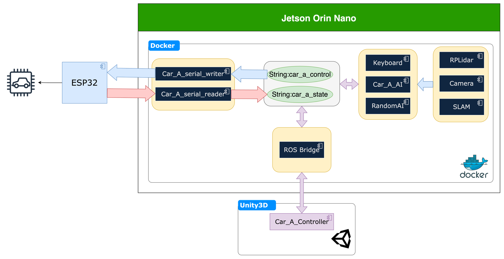

# PROS Application Launch Layer

`pros_app` is the Docker Compose launch layer for robot infrastructure. It
starts sensors, Unity adapters, SLAM, localization, Nav2, rosbridge/Foxglove,
GPS, IMU, camera calibration, and map storage. Car control and mission logic
live in `../pros_car`; YOLO perception lives in `../ros2_yolo_integration`.

## Workflow Diagram



## Current Scripts

Run scripts directly from this directory:

```bash
cd workspace/pros/pros_app
./localization_unity.sh
```

| Script | Purpose |
| --- | --- |
| `slam_unity.sh` | Unity robot bringup plus SLAM. |
| `localization_unity.sh` | Unity robot bringup, localization, and Nav2 navigation. |
| `slam.sh` | Real robot SLAM with RPLidar. |
| `slam_ydlidar.sh` | Real robot SLAM with YDLidar. |
| `slam_oradarlidar.sh` | Real robot SLAM with ORadar lidar. |
| `localization.sh` | Real robot localization/navigation with RPLidar. |
| `localization_ydlidar.sh` | Real robot localization/navigation with YDLidar. |
| `localization_oradarlidar.sh` | Real robot localization/navigation with ORadar lidar. |
| `store_map.sh` | Save the current SLAM map. |
| `camera_astra.sh` | Start Astra camera support. |
| `camera_dabai.sh` | Start Orbbec Dabai camera support. |
| `camera_gemini.sh` | Start Orbbec Gemini camera support. |
| `camera_calibration.sh` | Start physical camera calibration. |
| `camera_calibration_unity.sh` | Start Unity image conversion plus camera calibration. |
| `gps.sh` | Start GPS support. |
| `imu.sh` | Start IMU support. |
| `rosbridge_server.sh` | Start rosbridge/Foxglove bridge only. |
| `ros_topic_bridge.sh` | Start the configured ROS topic bridge. |

`control.sh` is still available as a menu wrapper, but it does not list every
script above. Direct script execution is recommended for repeatable demos.

## Common Workflows

### Unity Localization And Navigation

```bash
cd workspace/pros/pros_app
./localization_unity.sh
```

Use this before starting the Unity mission stack in `../pros_car`.

### Real Robot Localization And Navigation

Pick the script matching the installed lidar:

```bash
cd workspace/pros/pros_app
./localization.sh                # RPLidar
# ./localization_ydlidar.sh      # YDLidar
# ./localization_oradarlidar.sh  # ORadar
```

Start the physical camera stack separately if YOLO needs camera input:

```bash
./camera_gemini.sh
# ./camera_astra.sh
# ./camera_dabai.sh
```

### SLAM And Map Storage

Start one SLAM stack:

```bash
./slam_unity.sh          # Unity
# ./slam.sh              # RPLidar
# ./slam_ydlidar.sh      # YDLidar
# ./slam_oradarlidar.sh  # ORadar
```

After the map is ready, save it:

```bash
./store_map.sh
```

Stop SLAM before starting localization; both stacks should not own the map/TF
pipeline at the same time.

## Docker Network

All runtime stacks use the external bridge network
`compose_my_bridge_network`. Create it once if it does not exist:

```bash
docker network create --driver bridge compose_my_bridge_network
```

The compose files declare a local network key such as `my_bridge_network`, but
the external Docker network name is `compose_my_bridge_network`.

## Compose Implementation

Most scripts call `utils.sh`, which:

1. Chooses `docker-compose` or `docker compose`.
2. Starts one or more compose files with `up -d`.
3. Tails logs.
4. Shuts the same compose files down on `SIGINT`.

Examples:

| Script | Compose files |
| --- | --- |
| `localization_unity.sh` | `docker-compose_robot_unity.yml`, `docker-compose_localization_unity.yml`, `docker-compose_navigation_unity.yml` |
| `localization.sh` | `docker-compose_rplidar.yml`, `docker-compose_localization.yml`, `docker-compose_navigation.yml` |
| `localization_oradarlidar.sh` | `docker-compose_lidar_pkg.yml`, `docker-compose_oradarlidar.yml`, `docker-compose_localization.yml`, `docker-compose_navigation.yml` |
| `slam_unity.sh` | `docker-compose_robot_unity.yml`, `docker-compose_slam_unity.yml` |
| `slam_oradarlidar.sh` | `docker-compose_lidar_pkg.yml`, `docker-compose_oradarlidar.yml`, `docker-compose_slam_oradarlidar.yml` |

## Real Robot Device Names

The physical robot expects persistent udev names:

| Device | Expected path |
| --- | --- |
| Front wheel ESP32 | `/dev/usb_front_wheel` |
| Rear wheel ESP32 | `/dev/usb_rear_wheel` |
| Robot arm ESP32 | `/dev/usb_robot_arm` |
| RPLidar | `/dev/usb_lidar` |
| YDLidar | `/dev/usb_ydlidar` |
| ORadar lidar | `/dev/oradar` |
| GPS | `/dev/usb_gps` |
| IMU | `/dev/imu_usb` |

If a lidar container starts but no scan appears, confirm the device path and the
lidar baud rate for the installed model.

## Image Transport

The camera pipelines use ROS 2 image transport plugins for compressed image and
compressed depth topics. YOLO currently expects camera topics configured in
`workspace/pros/ros2_yolo_integration/src/yolo_pkg/config/yolo_params.yaml`,
including `/camera/image/compressed`, `/camera/depth/compressed`, and
`/camera/depth/image_raw`.

Use `bmon`, `docker stats`, Foxglove, or `ros2 topic hz` to inspect bandwidth and
topic health during demos.
